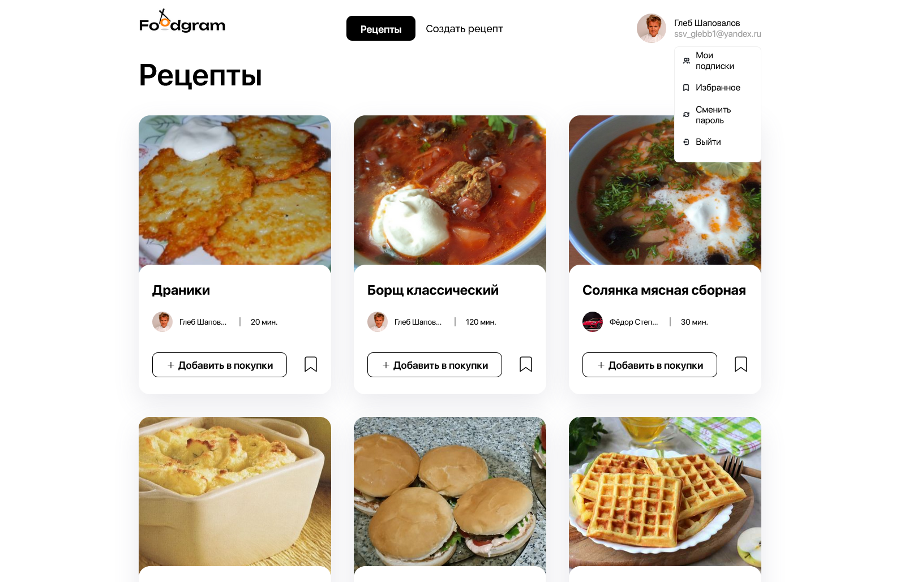

<div style="text-align:center">


# Foodgram - Платформа для публикации рецептов

**Foodgram - это веб-приложение, где пользователи могут делиться своими кулинарными рецептами, находить вдохновение в рецептах других авторов и удобно планировать покупки.**

*Powered by **[Python 3.10](https://www.python.org/downloads/release/python-31017/)**, **[Django](https://www.djangoproject.com/)**, **[React](https://react.dev/)**, **[Nginx](https://nginx.org/)** and **[PostgreSQL](https://www.postgresql.org/)***



</div>

## Запуск проекта

Запустить проект можно в двух вариантах: неполный (локальный) и полный (на Docker).  
Оба варианта можно запустить автоматически (через сценарий Powershell) или вручную, введя нужные команды.

### Неполный (локальный) запуск

Запуск сервера Django с опцией DEBUG и базой данных SQLite3.  
Перед запуском установите [Python 3.10](https://www.python.org/downloads/release/python-3100/) и создайте свой файл .env (пример можно найти в example.env)

После запуска можно будет посмотреть следующие страницы:
- **http://localhost:8000/** - Ссылка на основную страницу бэкенда
- **http://localhost:8000/api** - API бэкенда
- **http://localhost:8000/admin** - Django Admin

#### Автоматический запуск

```powershell
# Первоначальный запуск
powershell.exe -ExecutionPolicy ByPass .\infra\run_development.ps1 -Setup

# Последующие запуски, не требующие установок пакетов
powershell.exe -ExecutionPolicy ByPass .\infra\run_development.ps1

# Также можно запустить сервер Django нажав ПКМ по скрипку в папке,
# затем в контекстном меню 'Выполнить с помощью Powershell'.
# ПРИМЕЧАНИЕ: Может потребоваться изменение политики выполнения скриптов в системе
```

#### Ручной запуск

Создайте и активируйте виртуальное окружение:
```powershell
# В папке /
cd backend
py -m venv venv
. venv/Scripts/Activate
```

Установите необходимые пакеты:
```powershell
pip install -r requirements.txt
```

Скопируйте файл .env в папку `/backend/foodgram` (или выполните следующую команду):
```powershell
cd ..
cp infra/.env backend/foodgram/.env
```

Для локального запуска рекомендуются параметры `DJANGO_IS_DEBUG=True` и `DJANGO_IS_SQLITE3=True`.

Выполните миграции, импорт тестовых данных и коллекцию статики:
```powershell
py backend/foodgram/manage.py migrate
py backend/foodgram/manage.py loaddata backend/data/initial_data.json
py backend/foodgram/manage.py collectstatic --noinput
```

Скопируйте тестовые медиа-данные:
```powershell
cp data/volume backend/foodgram/media
```

Запустите сервер:
```powershell
cd ..
py backend/foodgram/manage.py runserver
```

### Полный запуск с Docker

Запуск всего compose-стека в Docker (включает Django, PostgreSQL и Nginx).
Перед запуском установите Docker для своей ОС:
- **[Docker on Windows](https://docs.docker.com/docker-for-windows/install/)**
- **[Docker on macOS](https://docs.docker.com/docker-for-mac/install/)**
- **[Docker on Linux](https://docs.docker.com/engine/install/)**

После запуска можно будет посмотреть следующие страницы:
- **http://localhost/** - Ссылка на основную страницу Foodgram
- **http://localhost/api/docs/** - Ссылка на спецификацию документации
- **http://localhost/api** - API бэкенда
- **http://localhost/admin** - Django Admin

#### Автоматический запуск

```powershell
# Первоначальный запуск
powershell.exe -ExecutionPolicy ByPass .\infra\run_production.ps1 -Setup

# Последующие запуски, не требующие установок пакетов
powershell.exe -ExecutionPolicy ByPass .\infra\run_production.ps1

# Также можно запустить сервер Django нажав ПКМ по скрипку в папке,
# затем в контекстном меню 'Выполнить с помощью Powershell'.
# ПРИМЕЧАНИЕ: Может потребоваться изменение политики выполнения скриптов в системе
```

#### Ручной запуск

Разверните compose-стек:
```powershell
# В папке /infra
docker compose up --force-recreate --build -d
```

Установите необходимые пакеты:
```powershell
pip install -r requirements.txt
```

Для полного запуска рекомендуются параметры `DJANGO_IS_DEBUG=False` и `DJANGO_IS_SQLITE3=False`.

Выполните миграции, импорт тестовых данных и коллекцию статики:
```powershell
docker compose exec backend python foodgram/manage.py migrate
docker compose exec backend python foodgram/manage.py loaddata data/initial_data.json
docker compose exec backend python foodgram/manage.py collectstatic --noinput
```

Скопируйте тестовые медиа-данные:
```powershell
docker cp $MediaVolume/. foodgram-backend:/app/foodgram/media
```